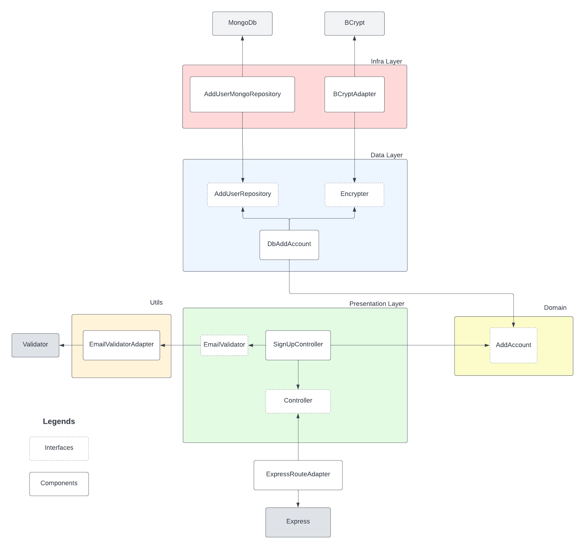

# Project - Pulls API with Solid, Clean Code And Clean Architecture 💻

---

## Developed with 😎

<div align="center">
  

  
</div>

---

## Description

This a simple project to study concepts to solid, clean code and clean architecture.

## Architecture version 1.0



---
## Installation

```bash
$ npm install
```

## Running the app

```bash
$ npm run dev
```


---
## License 🥰

Copyright © 2021, [Gabriel D. Padua](https://github.com/gabrielDpadua21).
Released under the [MIT license](LICENSE).